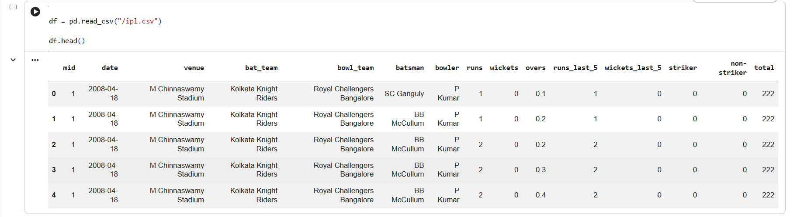
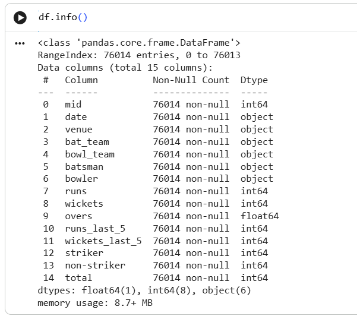
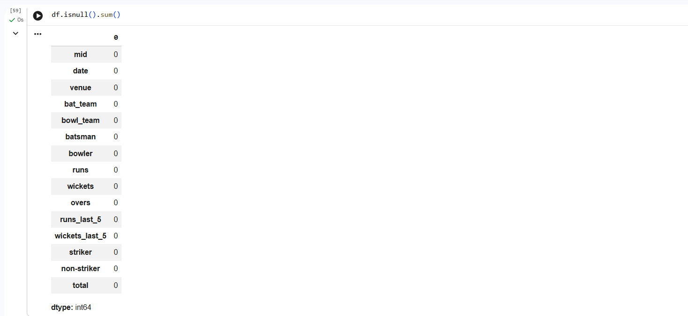
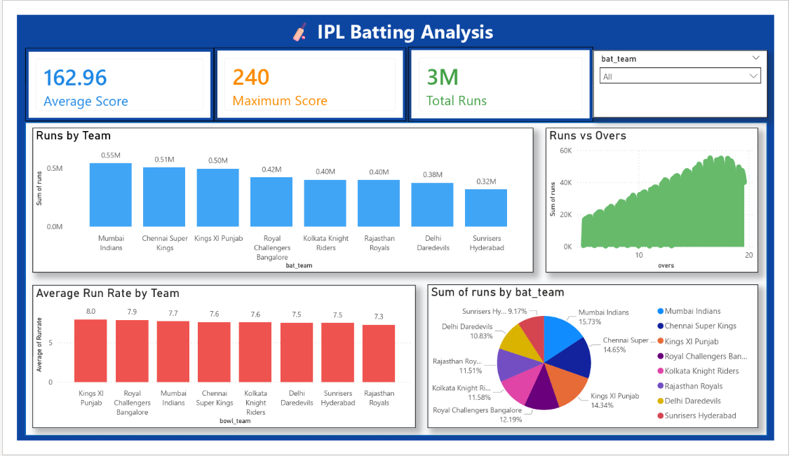
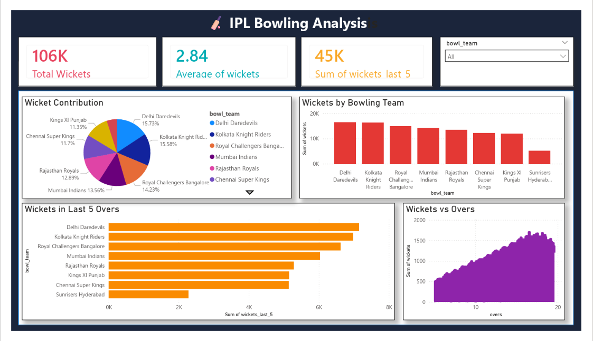
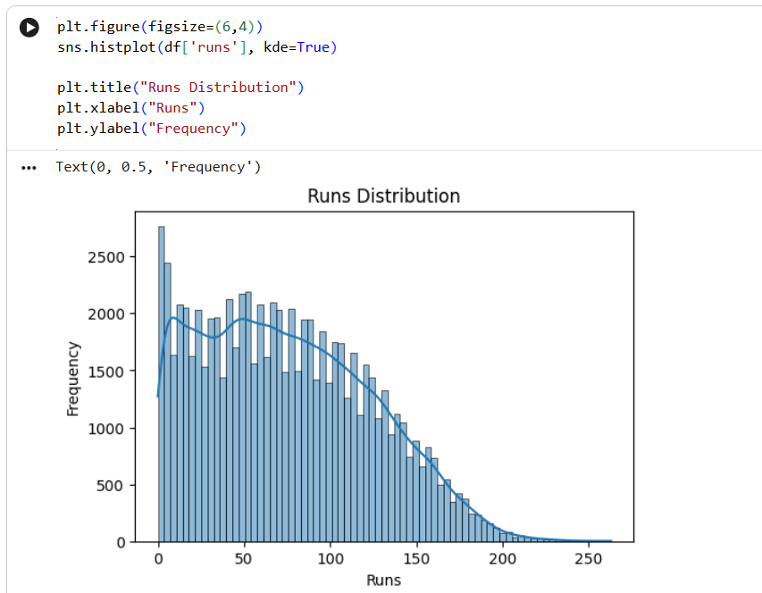
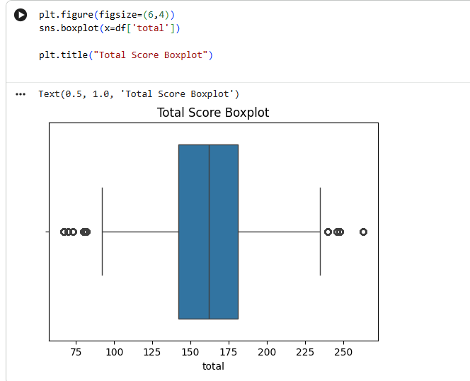

#  IPL Data Analysis & Dashboard

##  Project Overview

This project focuses on analyzing IPL (Indian Premier League) match data using Python and Power BI. The dataset contains ball-by-ball match information, which was explored to uncover insights related to batting performance, bowling statistics, team contributions, scoring patterns, and match trends.

The project combines Exploratory Data Analysis (EDA), statistical analysis, and interactive dashboards to provide meaningful insights from historical IPL data.

---

##  Objectives

- Perform data cleaning and preprocessing
- Analyze batting and bowling performance
- Identify scoring trends and distributions
- Explore team-wise contributions
- Detect outliers and patterns in match scores
- Create interactive Power BI dashboards

---

## 🛠️ Tools & Technologies

- Python
- Pandas
- NumPy
- Matplotlib
- Seaborn
- Power BI
- Jupyter Notebook

---

##  Dataset Information

The dataset contains IPL ball-by-ball match data with the following key attributes:

- Match ID
- Date
- Venue
- Batting Team
- Bowling Team
- Batsman
- Bowler
- Runs
- Wickets
- Overs
- Total Score
- Runs in Last 5 Overs
- Wickets in Last 5 Overs

---

##  Analysis Performed

### Data Exploration
- Dataset overview
- Data type analysis
- Missing value analysis
- Statistical summary

### Batting Analysis
- Team-wise total runs
- Average score analysis
- Run rate comparison
- Runs distribution

### Bowling Analysis
- Team-wise wickets analysis
- Wicket contribution analysis
- Wickets in last 5 overs
- Bowling performance comparison

### Statistical Analysis
- Correlation analysis
- Distribution analysis
- Outlier detection using boxplots

---

## 📸 Project Screenshots

### Dataset Overview


### Dataset Information


### Missing Values Analysis


### IPL Batting Analysis Dashboard


### IPL Bowling Analysis Dashboard


### Runs Distribution


### Total Score Boxplot


---

##  Key Insights

- Mumbai Indians scored the highest total runs among teams.
- Delhi Daredevils and Kolkata Knight Riders contributed the highest wickets.
- Average IPL team score is approximately 163 runs.
- Dataset contains no missing values.
- Score distribution shows variation across matches with a few outliers.
- Batting and bowling dashboards provide team-wise performance comparisons.

---

##  How to Run

1. Clone the repository

```bash
git clone https://github.com/your-username/IPL-Data-Analysis-and-Dashboard.git
```

2. Open Jupyter Notebook

```bash
jupyter notebook
```

3. Install required libraries

```bash
pip install pandas numpy matplotlib seaborn
```

4. Run the notebook cells sequentially.

---

##  Project Structure

```text
IPL-Data-Analysis-and-Dashboard/
│
├── ipl.csv
├── ipl.ipynb
├── Batting_Analysis.png
├── Bowling_Analysis.png
├── Dataset_Overview.png
├── Dataset_info.png
├── Missing_Value.png
├── Runs_Distribution.png
├── Total_Score_Boxplot.png
└── README.md
```

---

##  Author

**Paras Kanani**

Aspiring Data Analyst | Python | Power BI | Data Visualization

